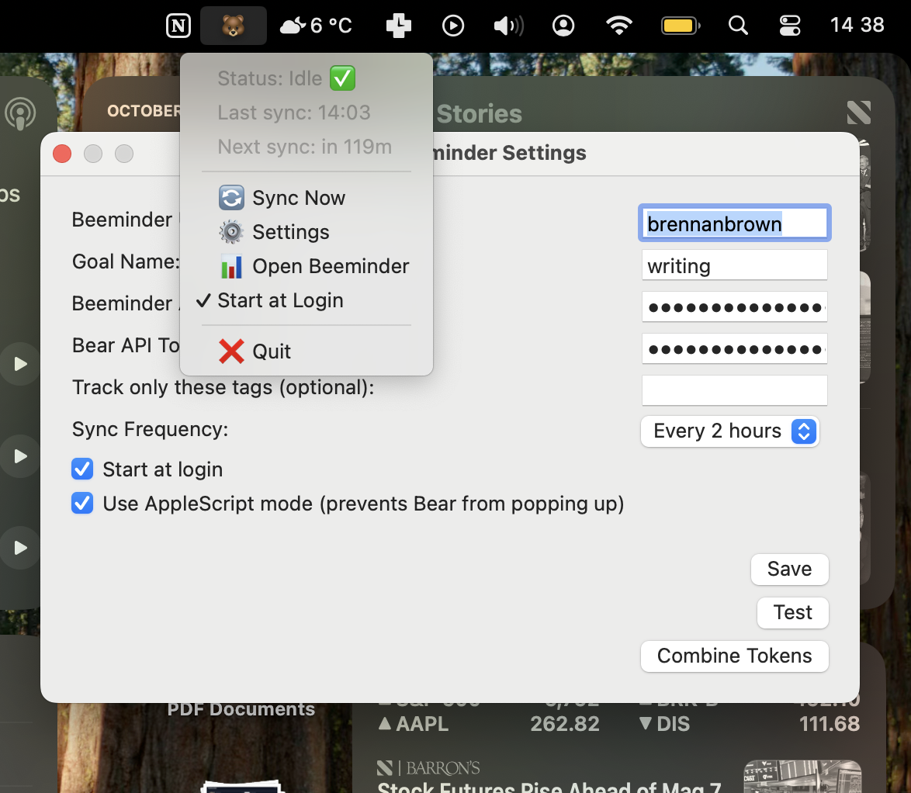

<div align="center">

# 🐻 BearMinder

### Bear → Beeminder word tracker for macOS

[](https://www.apple.com/macos/)
[](https://swift.org)
[](LICENSE)
[](https://github.com/brennanbrown/bearminder/issues)
[](https://github.com/brennanbrown/bearminder/stargazers)

[Features](#-features) • [Quick Start](#-quick-start-non-technical-users) • [Developer Guide](#-developer-guide) • [Support](#-support)

---

</div>



## 📖 About

**BearMinder** is a tiny macOS menubar app that totals the words you wrote in Bear today and posts them to your Beeminder goal. It stays out of the way, runs on‑demand or hourly, and keeps your tokens securely in the Keychain.

### 💡 Why This Exists

I used to rely on [Draft](https://web.archive.org/web/20230102225504/http://draftin.com/) for daily writing with an auto‑sync to Beeminder. Since Draft shut down, there hasn't been an enjoyable replacement. BearMinder fills that gap by letting me keep writing in Bear and still feed my Beeminder goal automatically.

### 🔗 What About URLminder?

Beeminder's official [URLminder integration](https://help.beeminder.com/article/88-urlminder) is still active and works great if you write in Google Docs, Dropbox, or any publicly accessible URL. However, if you prefer writing in Bear (a native macOS notes app with excellent Markdown support), URLminder won't work since Bear notes aren't web-accessible. BearMinder bridges that gap, letting Bear users enjoy the same automatic word-count tracking that URLminder provides for cloud documents.

### 📚 References

- [Archive of Draft](https://web.archive.org/web/20230102225504/http://draftin.com/)
- [Beeminder discussion on Draft's shutdown](https://forum.beeminder.com/t/the-state-of-draft/10366/5)
- [URLminder help docs](https://help.beeminder.com/article/88-urlminder)
- [URLminder announcement](https://blog.beeminder.com/urlminder/)

### 🔗 Quick Links

| Documentation | Project |
|--------------|---------|
| [Spec Sheet](docs/spec-sheet.md) | [Changelog](CHANGELOG.md) |
| [App Setup](docs/AppSetup.md) | [Roadmap/TODO](TODO.md) |
| [Build Write-up](docs/blog-building-bearminder.md) | [Issues](https://github.com/brennanbrown/bearminder/issues) |

---

## ✨ Features

- 🐻 **Seamless Bear Integration** — Automatically tracks words from your Bear notes
- 📊 **Beeminder Sync** — Posts daily word counts to your Beeminder goal
- ⏰ **Automatic Hourly Sync** — Configurable intervals (30/60/120 minutes)
- 🔒 **Secure Token Storage** — Uses macOS Keychain for API tokens
- 🎯 **Smart Delta Tracking** — Only posts today's new words (idempotent)
- 🚫 **Unobtrusive** — Tiny menubar app that stays out of your way
- 📝 **Rich Comments** — Datapoints include word count, notes modified, and tags


## 🚀 Quick Start (non‑technical users)

### 1️⃣ Install and Open the App

- Build from source (ask a friend) or download a signed build when available
- Launch the app — a 🐻 icon appears in your macOS menu bar

### 2️⃣ Open Settings

Click 🐻 → Settings and fill in:

- **Beeminder Username**
- **Beeminder API Token** — Get it from [beeminder.com/api/v1/auth_token.json](https://www.beeminder.com/api/v1/auth_token.json)
- **Beeminder Goal** — For example: `writing`
- **Bear API Token** — In Bear: Help → Advanced → API Token → Copy

💾 **Save.** On first access, macOS may ask you to allow Keychain access. Choose **"Always Allow"** so you aren't asked again on each launch.

### 3️⃣ Run Your First Sync

- Click 🐻 → **Sync Now**
- Your datapoint's comment shows a concise one‑line summary (words, notes, tags)

### 4️⃣ Daily Use

- ✍️ **Just write in Bear** — nothing else to do!
- ⏰ Automatic hourly sync runs in the background (frequency is configurable in Settings: 30/60/120m)
- 🐻 The menubar shows 🐻 when everything is working and 🔴 when there's an error
- 📊 The menu shows "Last sync" and "Next sync" details
- 🔄 Click 🐻 → Sync Now anytime (BearMinder won't post a zero if you didn't write since the last sync)

### 🔧 Troubleshooting

| Issue | Solution |
|-------|----------|
| **Bear pops up during sync** | Enable "Use AppleScript mode" in Settings to prevent Bear from coming to the foreground |
| **No 🐻 in the menu bar** | Make sure the app launched. If needed, quit and relaunch |
| **Keychain permissions every launch** | Choose "Always Allow" when prompted, or open Keychain Access and add BearMinder to Access Control for items with Service "beeminder" and "bear" |
| **No words posted despite writing** | Click Sync Now and check the log. BearMinder counts only words written today (UTC) across notes modified today |

---

## 📊 What Gets Posted to Beeminder

- **Value** — Today's delta only (idempotent): words added today since yesterday's final counts
- **Comment** — A short one‑line summary:
  ```
  📝 {today_words}w | 📚 {notes_modified} notes | 🏷️ {unique_tags} tags • 🐻 via Bear → Beeminder
  ```

> 💡 **Tip:** We only post today's delta. If there's no new writing since the last sync, BearMinder won't post a 0 (to avoid clobbering a positive datapoint).


---

# 👨‍💻 Developer Guide

## 📁 Project Structure

```
Apps/BearMinder/        # XcodeGen app project (AppKit menubar app)
AppTemplate/            # App layer (AppDelegate, StatusItemController, Settings window)
Sources/                # Swift Package modules
  ├── Models/           # Data models (snapshots, tracking, settings, datapoints)
  ├── Logging/          # Simple logging helper
  ├── KeychainSupport/  # Keychain read/write wrappers
  ├── BeeminderClient/  # Beeminder datapoint POST client
  ├── BearClient/       # Bear client and types
  ├── Persistence/      # Persistence protocol + Core Data implementation
  └── SyncManager/      # Polling/trigger logic
docs/                   # Spec and setup notes
```

## 🔨 Build & Run

### Generate Xcode Project

```bash
cd Apps/BearMinder
xcodegen generate
open BearMinder.xcodeproj
```

Select the `BearMinder` scheme → Destination `My Mac` → Build & Run.

### Command‑Line Build

```bash
# Build into ./build without code signing
xcodebuild -project Apps/BearMinder/BearMinder.xcodeproj \
  -scheme BearMinder -configuration Debug \
  -derivedDataPath build CODE_SIGNING_ALLOWED=NO build

# Launch the built app
open build/Build/Products/Debug/BearMinder.app
```

## 🔐 Local Credentials (Optional for Dev)

Create `local/credentials.json` (gitignored) using `local.sample/credentials.json`:

```json
{
  "beeminderUsername": "yourname",
  "beeminderGoal": "writing",
  "beeminderToken": "...",
  "bearToken": "..."
}
```

On launch, `AppTemplate/LocalConfigLoader.swift` seeds `UserDefaults` + Keychain if empty.

## 🧮 How Today's Words Are Computed

### BearIntegrationManager Flow

1. Triggers a Bear `search` x‑callback with an empty term (broad search)
2. Bear returns a JSON `notes` array
3. Filters to notes whose `modificationDate` is today (UTC)
4. For each note, calls `open-note` to fetch metadata and body text
5. Counts words from the `text` or `note` callback param

### AppDelegate Sync Flow

1. **Baseline** = yesterday's end‑of‑day count per note (UTC); if none, baseline = 0
2. **Today's delta** = sum(max(0, current - baseline)) for all notes modified today
3. Stores `NoteTracking` for today with `previousWordCount = baseline`, `currentWordCount = current`
4. Posts only today's delta to Beeminder, skipping if delta is 0

## 🔧 Key Technical Details

| Component | Implementation |
|-----------|----------------|
| **Menu bar icon** | `AppTemplate/StatusItemController.swift` (emoji title fallback for reliability) |
| **App entrypoint** | Explicit `@main` class in `AppTemplate/Main.swift` (avoids lifecycle ambiguity) |
| **URL callbacks** | `AppTemplate/AppDelegate+URLHandling.swift` registers for `kAEGetURL` |
| **Token storage** | `Sources/KeychainSupport/KeychainSupport.swift` with `kSecAttrAccessibleAfterFirstUnlock` |
| **Beeminder POST** | `Sources/BeeminderClient/BeeminderClient.swift` using `application/x-www-form-urlencoded` |
| **SyncManager** | Background hourly timer with exponential backoff retry (3 attempts, 5s base delay) |
| **Offline queue** | Failed datapoints queued on disk and sent on next successful sync |
| **Error handling** | Distinguishes retryable errors from permanent failures; respects Retry-After headers |
| **Persistence** | Core Data with lightweight migrations for automatic schema updates |

## 🗺️ Roadmap

- [ ] Sparkle auto‑updater and signed builds
- [ ] Code signing and hardened runtime
- [ ] Performance optimizations (target <10MB idle, <15MB during sync)
- [ ] Tag-based filtering UI and logic

## 🤝 Contributing

Issues and PRs welcome! Please:

- ✅ Keep UI tiny and unobtrusive
- 🔒 Guard tokens — never log secrets
- 🌍 Prefer UTC for dates and day boundaries
- 📝 Add concise logs around network calls and callbacks

---

## 💖 Support

If this project helps you, consider supporting:

<div align="center">

[](https://github.com/sponsors/brennanbrown)
[](https://ko-fi.com/brennan)

</div>

Have ideas or found a bug? [Open an issue](https://github.com/brennanbrown/bearminder/issues) 🐛

---

## 📄 License

**MIT** — See [LICENSE](LICENSE) for details

---

<div align="center">

Made with ❤️ by [Brennan Brown](https://brennanbrown.ca)

</div>
